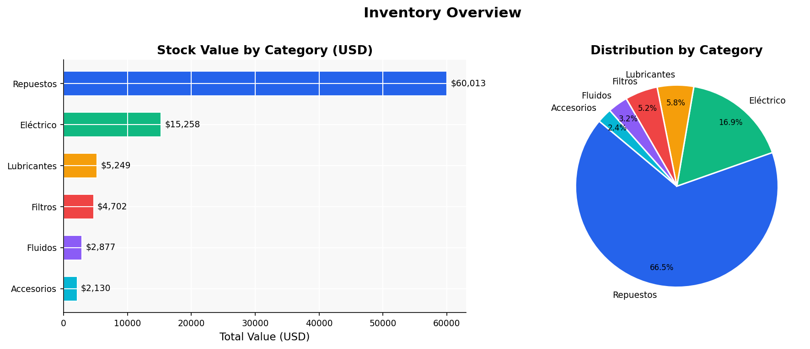
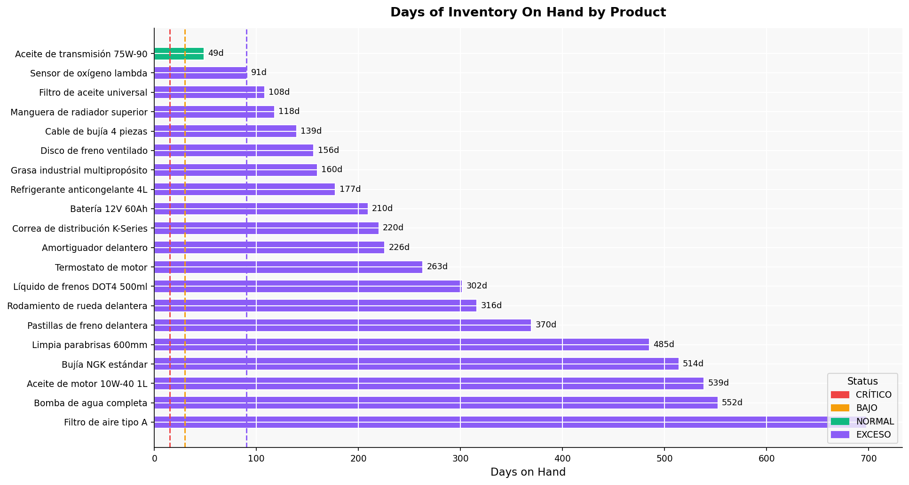
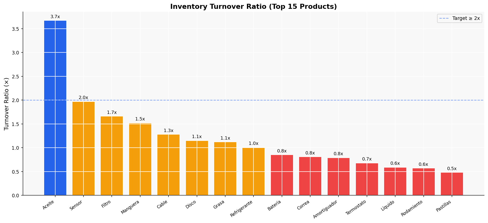
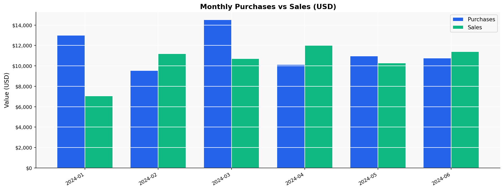
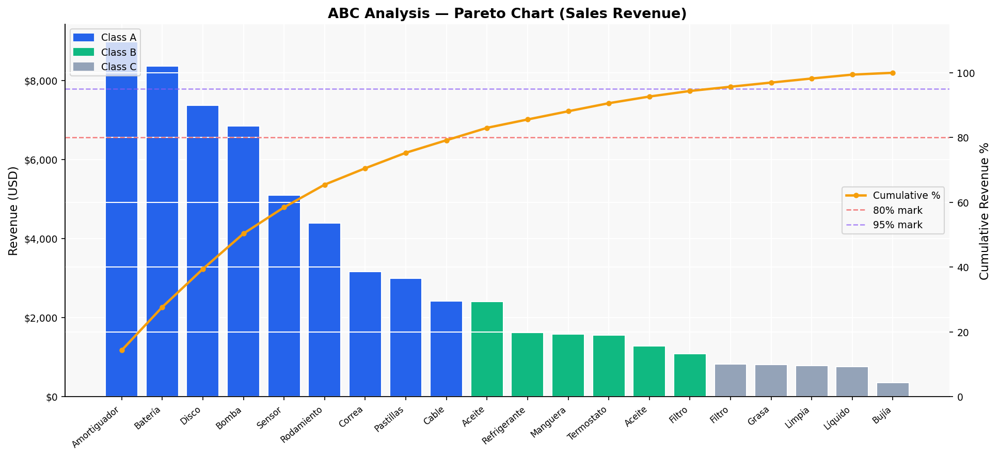
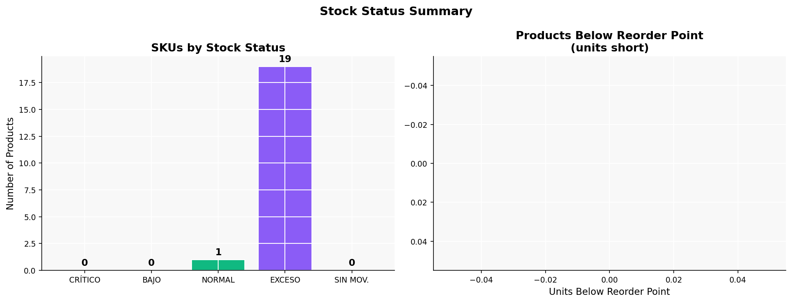

# 📦 Inventory & Stock Rotation Analysis


> End-to-end inventory analysis using Python and SQL — covering stock valuation, rotation KPIs, days on hand, ABC classification, and replenishment alerts. Built to replicate real warehouse analytics scenarios from supply chain operations.

---

## 🎯 Project Objective

Analyze a simulated warehouse dataset (20 SKUs · 3 warehouses · 180 days of transactions) to answer core inventory management questions:

- Which product categories hold the most capital?
- Which SKUs are rotating fast vs. sitting idle?
- How many days of stock remain at the current sales pace?
- Which products need immediate replenishment?
- What is the ABC classification by revenue contribution?

---

## 📊 Key Findings

| KPI | Result |
|-----|--------|
| Total inventory value | $90,229 USD |
| Average days on hand | 284 days |
| Average turnover ratio | 0.99× |
| Products in "Normal" range | 1 of 20 |
| Products with excess stock | 19 of 20 |
| Class A products (80% of revenue) | 8 SKUs |

**Main insight:** Inventory levels are too high relative to current sales velocity. Most SKUs show excess stock (>90 days on hand), suggesting over-purchasing or declining demand. The Aceite de transmisión 75W-90 is the only product with healthy rotation (3.67×, 48 days on hand).

---

## 📁 Repository Structure

```
inventory-analysis/
│
├── data/
│   ├── generate_dataset.py     # Script to regenerate the simulated dataset
│   ├── products.csv            # 20 products with cost, category, reorder points
│   ├── inventory.csv           # Current stock by product and warehouse
│   └── movements.csv           # 965 transactions (sales, purchases, adjustments)
│
├── sql/
│   ├── 01_create_tables.sql    # Schema definition (PostgreSQL / SQLite compatible)
│   └── 02_inventory_kpis.sql   # 7 analytical queries: turnover, DOH, ABC, dead stock
│
├── notebooks/
│   └── inventory_analysis.py   # Full EDA + KPI calculation + 6 visualizations
│
├── reports/
│   ├── inventory_analysis_report.csv   # Exported summary table
│   └── images/
│       ├── 01_stock_by_category.png
│       ├── 02_days_on_hand.png
│       ├── 03_turnover_ratio.png
│       ├── 04_monthly_trend.png
│       ├── 05_abc_pareto.png
│       └── 06_stock_status.png
│
└── README.md
```

---

## 🛠️ Tech Stack

| Tool | Purpose |
|------|---------|
| Python 3.10 | Data processing and visualization |
| Pandas | Data manipulation and KPI calculation |
| Matplotlib / Seaborn | Charts and dashboards |
| SQL (PostgreSQL / SQLite) | Schema design and analytical queries |
| CSV | Portable data storage |

---

## 📈 Visualizations

### Stock Value by Category


### Days of Inventory on Hand


### Inventory Turnover Ratio


### Monthly Purchases vs Sales


### ABC Pareto Analysis


### Stock Status Summary


---

## ▶️ How to Run

**1. Clone the repository**
```bash
git clone https://github.com/[your-username]/inventory-analysis.git
cd inventory-analysis
```

**2. Install dependencies**
```bash
pip install pandas numpy matplotlib seaborn
```

**3. Generate the dataset**
```bash
python data/generate_dataset.py
```

**4. Run the analysis**
```bash
python notebooks/inventory_analysis.py
```

**5. (Optional) Run SQL queries**
Load the CSV files into PostgreSQL or SQLite, run `sql/01_create_tables.sql` first, then `sql/02_inventory_kpis.sql`.

---

## 💡 SQL KPIs Included

1. **Stock value by category** — capital allocation overview
2. **Inventory turnover ratio** — COGS / Average Inventory
3. **Days on hand (DOH)** — stock / avg daily sales, with status flag
4. **Dead stock detection** — zero sales in 90 days with stock > 0
5. **Replenishment alerts** — products below reorder point
6. **Monthly purchase vs sales trend** — buy/sell flow over time
7. **ABC classification** — Pareto-based product segmentation

---

## 👤 About

**Javier [Apellido]**
Industrial Engineer | Supply Chain → Data Analytics
📍 Santa Cruz de la Sierra, Bolivia
🔗 [LinkedIn](https://linkedin.com/in/tu-perfil)
🌐 English C1 · Spanish native

> Background in warehouse management and inventory control (SOSUCRO). Currently building data analytics skills: SQL, Power BI, Python, Excel.

---

*Dataset is simulated for portfolio purposes. Structure and KPIs mirror real-world warehouse operations.*
